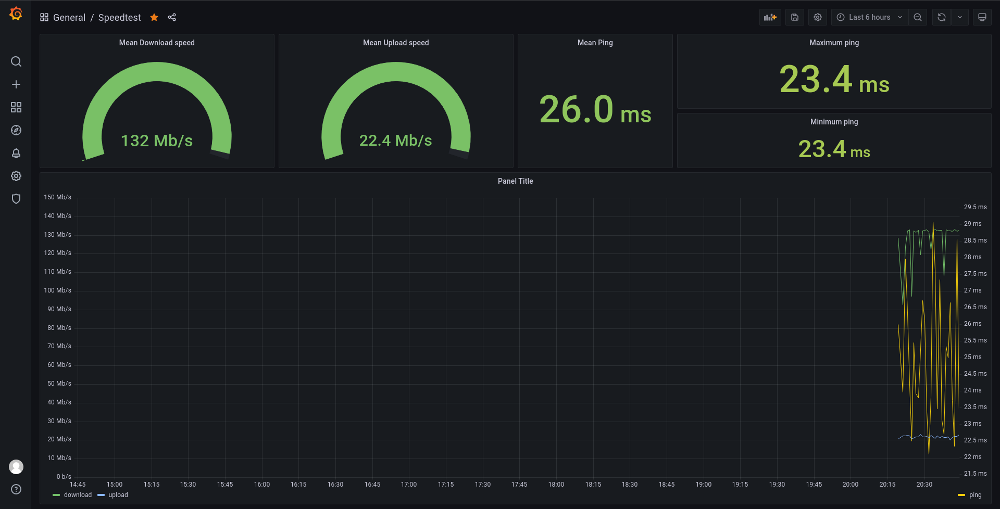

# Speedtest monitor for Grafana

A small project that allows internet speed monitoring using Grafana, InfluxDB 2 and Speedtest.

## Demo


## Requirements
- Docker and Docker compose.
- Python 3.+ (3.9.5 is recommended)
- Virtualenv `pip install virtualenv`

## Setup
### With Docker
Make sure Docker and Docker-compose are installed before running the following commnad

```bash
$ docker-compose build
$ docker-compose up
```

### For development
First make sure InfluxDB is up and running

```bash
$ docker-compose up influxdb
```
Once that is done you may setup your development environment. Make sure Python 3.x is installed

```bash
$ virtualenv .venv
$ source .venv/bin/activate
$ pip install -r requirements.txt
```